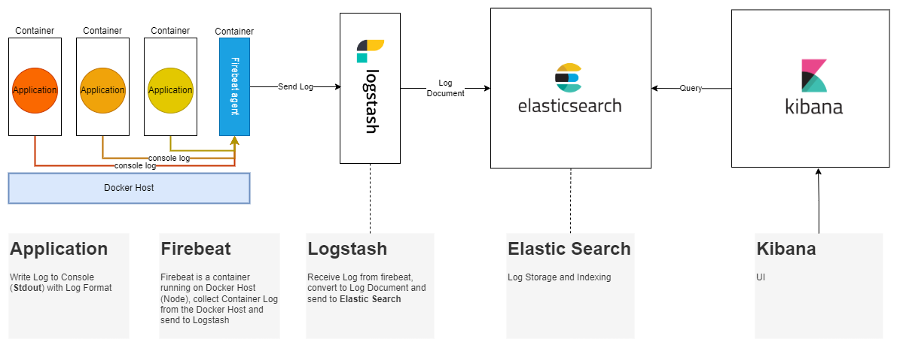
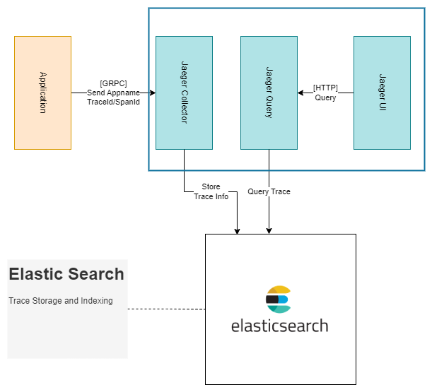

# ELK and Tracibility with Jaeger

## Setup

```sh
docker-compose up setup
```

## Run ELK, Filebeat and Jaeger

```console
$ docker-compose -f docker-compose.yml -f extensions/filebeat/filebeat-compose.yml -f jaeger/docker-compose.yml up
```

## Logging with ELK



## Tracing with Jaeger




## Reference 

[Full Documenation](./full-doc.md)